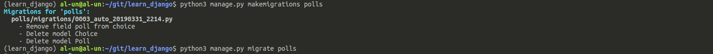
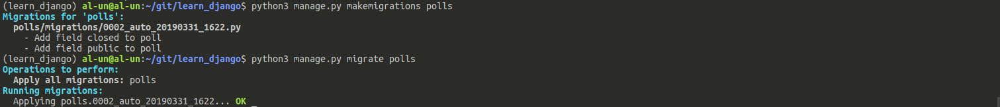

## Polls

### Poll app

```sh
pipenv run python3 manage.py startapp polls
```

Add the `polls` app to the project by updating _learn_django/settings.py_:

```py
INSTALLED_APPS = [
    # ...
    'polls'
]

```

References:

- [Django app tuto](https://docs.djangoproject.com/en/2.1/intro/tutorial01/#creating-the-polls-app)

### Models

All polls models are defined in _polls/models.py_. Add a simple `Poll` and
`Choice` in this file:

```py
from django.db import models

class Poll(models.Model):
    topic = models.CharField(max_length=200)

class Choice(models.Model):
    poll = models.ForeignKey(Poll, on_delete=models.CASCADE)
    text = models.CharField(max_length=200)
```

To update the database accordingly, migrations need to be generated and migrated:

```sh
pipenv run python3 manage.py makemigrations polls
pipenv run python3 manage.py migrate polls
```



To update an existing model, append additional fields and generate new migrations.
Let's consider the updated _polls/models.py_:

```py
from django.db import models

class Poll(models.Model):
    topic = models.CharField(max_length=200)
    public = models.BooleanField(default=True)
    closed = models.BooleanField(default=False)

class Choice(models.Model):
    poll = models.ForeignKey(Poll, on_delete=models.CASCADE)
    text = models.CharField(max_length=200)
```

> Models fields are method. Do not forget parenthesis such as `models.BooleanField()`

Poll has two more fields:

```sh
pipenv run python3 manage.py makemigrations polls
pipenv run python3 manage.py migrate polls
```


